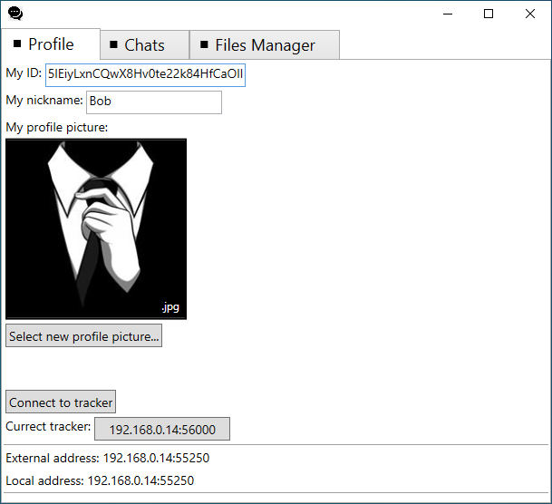
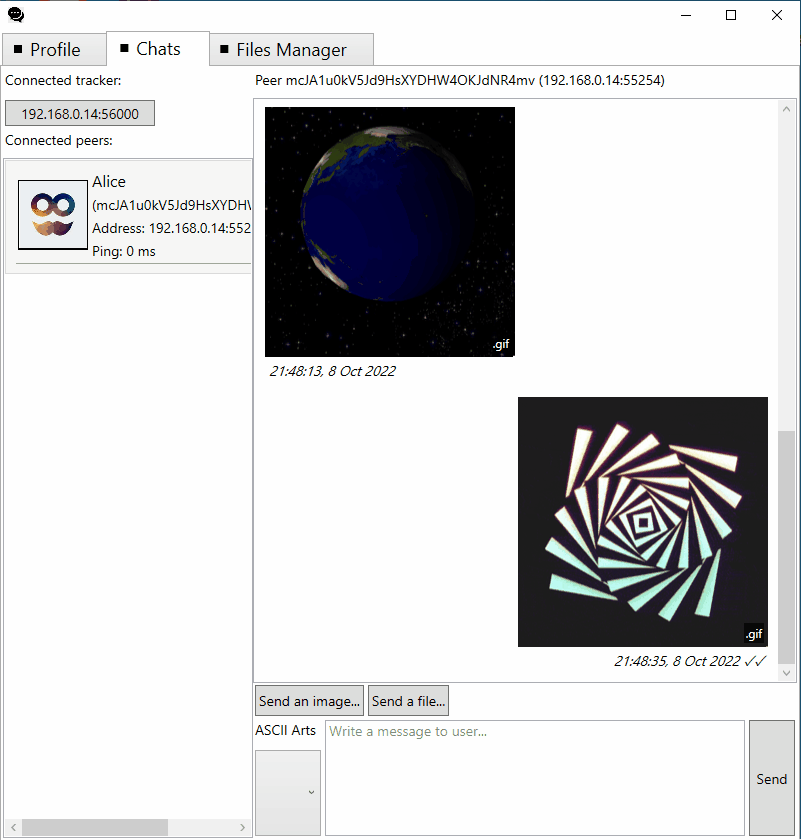
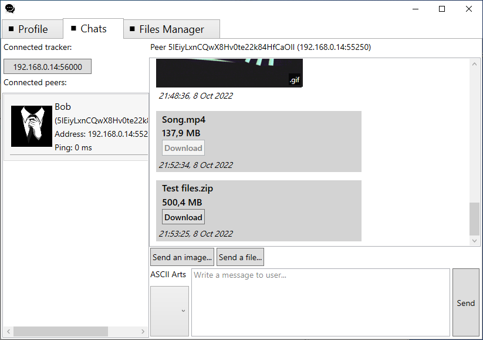
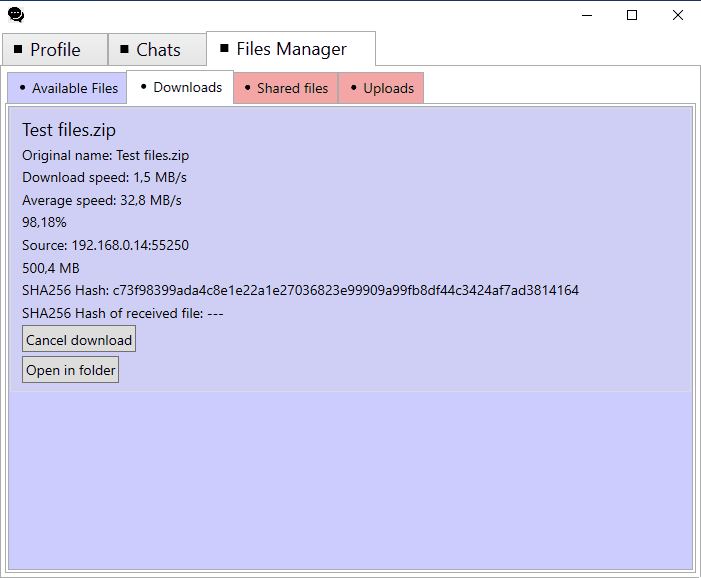

# Decentralized-Chat-Peer
Peer (client) of decentralized chat application.
## Overview

This project is a client of decentralized chat application. This app works on top of [reliable UDP library](https://github.com/RevenantX/LiteNetLib) and establishes secure connections using encryption algorithms: AES-256 and ECDH (WARNING: encryption protocol hasn't been thoroughly tested for vulnerabilities such as MITM, replay attack etc.) 

Main reason of using UDP instead of TCP is the ability to perform [UDP hole punching technique](https://bford.info/pub/net/p2pnat) so users that are inside different local networks can establish direct connection via Internet with help of [rendevous server](https://github.com/Backgammonian/Decentralized-Chat-Tracker-Console). After connection is done peers are able to send text messages and images to each other. 

This app can also be hidden in system tray and can send receipt notifications to user.

UPD: Now users can send files of any size and extension to each other! This functionality was borrowed from my [file sharing project](https://github.com/Backgammonian/File-Sharing).

## Libraries used in this project:
* [LiteNetLib](https://github.com/RevenantX/LiteNetLib)
* [Newtonsoft.Json](https://www.newtonsoft.com/json)
* [Meziantou.Framework.WPF - Thread-safe observable collection](https://github.com/meziantou/Meziantou.Framework)
* [SystemTrayApp.WPF](https://github.com/fujieda/SystemTrayApp.WPF/)
* [Microsoft.Tookit.Mvvm](https://github.com/CommunityToolkit/WindowsCommunityToolkit)
* [Microsoft.Xaml.Behaviours.Wpf](https://github.com/Microsoft/XamlBehaviorsWpf)
* [NGif](https://www.codeproject.com/Articles/11505/NGif-Animated-GIF-Encoder-for-NET)
* [System.Drawing.Common](https://www.nuget.org/packages/System.Drawing.Common/)
* [Placeholder Text Box](https://youtu.be/QUx2gh0PaEc)
## Demonstration:

